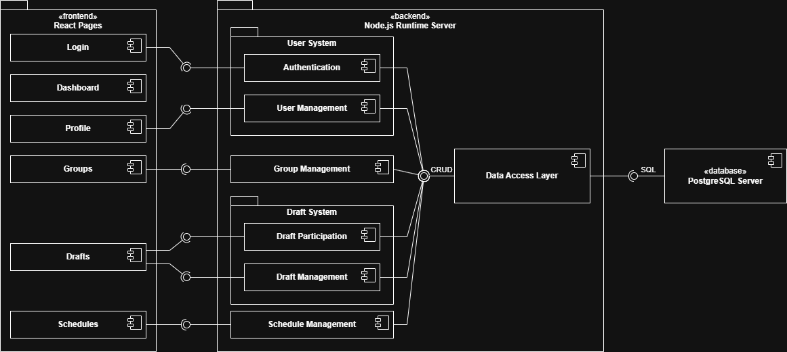
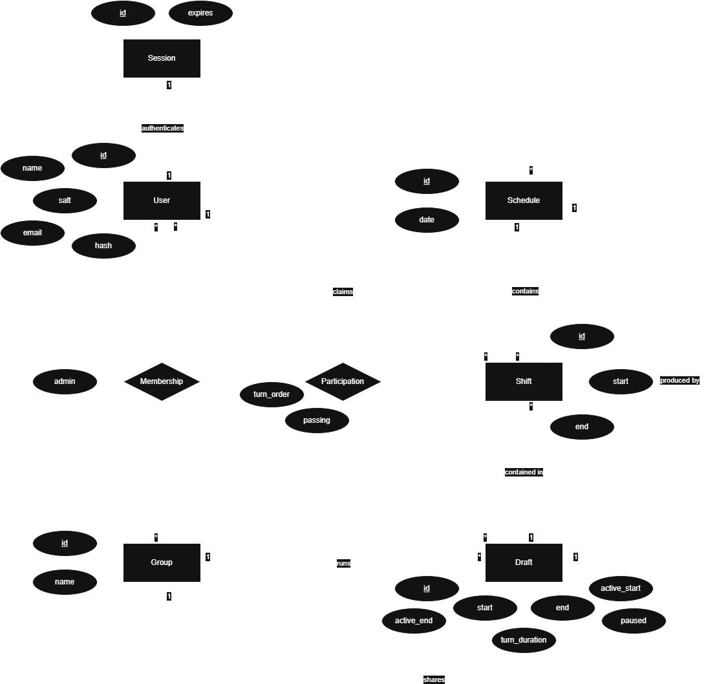
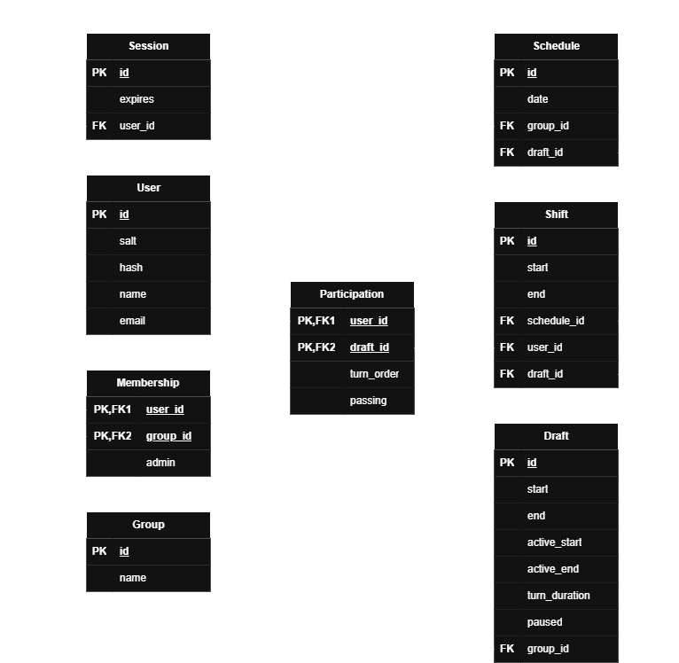

# Architecture Specification

## Model

This project will utilize a classic *layered architectural model* with frontend, backend, and database layers. The frontend will be built in React Native, while the backend will be built in JavaScript and will utilize the Node.js runtime. The database will be PostgreSQL.

## Diagrams

*Code* is the DNA of any project. Architecture diagrams should guide and encourage coding and enable communication with stakeholders. Diagrams should not become a sinkhole for misallocated work, nor should they be relied upon as infallible descriptions of the system. With that precaution in mind, these are the diagrams I find to be of high value in visualizing this project from the outset.

### System

#### Component Diagram

### Database

#### ER Diagram

#### Schema

---

[Back to README](../README.md)